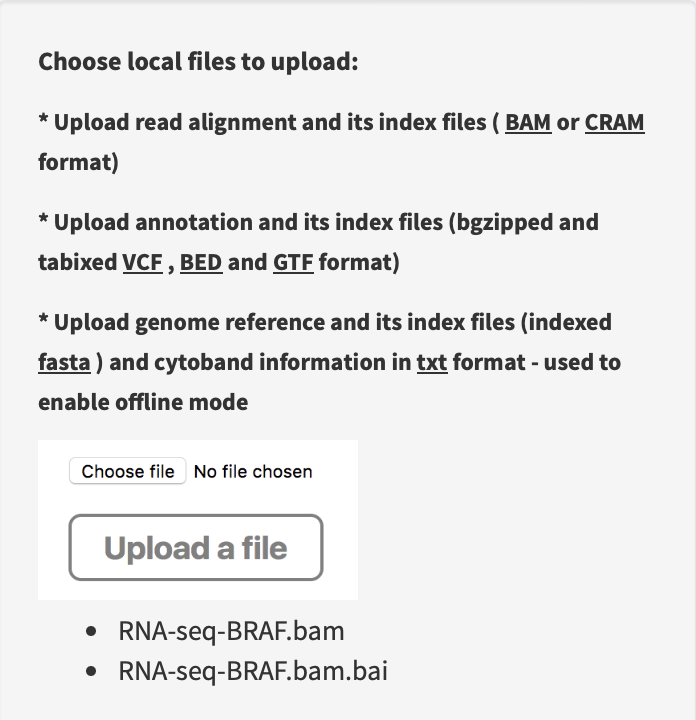

## Appendix

Although FuSViz is designed for SV interpretation and visualization of multiple samples, it could be utilized for single sample analysis together with read alignments as well. Currently, read alignment import is allowed in **Linear** and **Two-way** modules.

### Quality control of SVs via read alignment in Linear module

1. Upload alignment and index files together. For example, import an RNA-seq alignment in BAM format.

2. Click genomic breakpoint of one SV in Table overview section (e.g. _692478_ or _35549292_ in tab panel `SV from RNA-seq`)

3. Inspect read alignment supporting the clicked breakpoint in **Linear module**

A **split-window** mode is used to investigate alignment quality of split reads mapped to ERICH1 and UNC5D genes. Soft-clip parts of read aligments (black box) at ERICH1 and UNC5D breakpoints match to SV sequences of UNC5D and ERICH1 (black dash lines), respectively.

### Load alignment track from URL address in Linear module

If alignment data is shared via cloud or hosted in a remote server, users can load it together with index via URL web address. For example,

A **split-window** mode is used to investigate alignment quality of discordant read pairs mapped to different genomic loci. The read pair highlighted in dash boxes shows a discordant mapping feature to partner genes ABHD12B and RCC1, respectively.

### Visualize SV event together with read coverage using Two-way module

It is performed under command line (**NOT** available in web interface) using the function `plot_separate_individual_bam`. Firstly, load FuSViz package as below:

	library(FuSViz)
	options(uscsChromosomeName=FALSE)

Set gene/transcript annotation version (e.g. **hg19**) and RNA-seq alignment path

	version = "hg19"; # or “hg38”
	rna_bam_path=file.path(extdata = system.file("extdata", package = "FuSViz"), "RNA-seq-example.bam")

#### Use ‘plot_separate_individual_bam’ to visualize fusion together with RNA-seq read coverage

For example, plot a fusion event of “PIK3R1-HSD17B4”

	plot_separate_individual_bam(first_name = "PIK3R1", second_name = "HSD17B4", breakpoint_A = 67576834, breakpoint_B = 118792010, coverage_plot_trans = F, version=version, rna_bam_path = rna_bam_path, split = 9, span = 1, fusion_strandA="+", fusion_strandB="-")

From the top it shows the position of partner genes in a chromosome ideogram, the fusion event (a curved line marked by read support [9 - split read, 1 – spanning read pair]; arrow indicates transcribed direction of the fusion), exon annotations of different transcript isoforms for upstream (colored by **green**) and downstream (colored by **orange**) partners, RNA expression level measured by read counts and genomic coordinates of partner gene loci in Mb from chromosome. `coverage_plot_trans = F` suggests RNA read coverage is plotted using reads mapped to exons and introns of geneA and geneB transcript isforms.

#### Visualize fusion and read coverage calculated using specific transcript isoforms

	plot_separate_individual_bam(first_name = "PIK3R1", second_name = "HSD17B4", breakpoint_A = 67576834, breakpoint_B = 118792010, coverage_plot_trans = T, version=version, rna_bam_path = rna_bam_path, transcriptA="ENST00000521381 ENST00000274335", transcriptB="ENST00000414835", split = 9, span = 1, fusion_strandA="+", fusion_strandB="-")

`coverage_plot_trans = T` suggests RNA-seq read coverage is plotted using the exons of selected transcripts **ENST00000521381** and **ENST00000414835**. If breakpoint falls within a intron, read coverage of the related intron is plotted as well.

#### Visualize fusion and read coverage calculated by duplicated aligned reads

As default, the coverage is plotted using un-duplicated aligned reads (i.e. `duplicate=F`). If users would like to plot coverage using duplicated aligned reads, please set `duplicate=T` (NOTE: `duplicate=T` only works when alignment is processed by Picard or Samtools with the setting **MarkDuplicate=T**).

#### Visualize fusion if DNA-seq read coverage is available

	dna_bam_path=file.path(extdata = system.file("extdata", package = "FuSViz"), "DNA-seq-example.bam");
	plot_separate_individual_bam(first_name = "PIK3R1", second_name = "HSD17B4", breakpoint_A = 67576834, breakpoint_B = 118792010, coverage_plot_trans = F, version=version, chrom_notation_rna = T, chrom_notation_dna = F, split = 9, span = 1, rna_bam_path = rna_bam_path, dna_bam_path = dna_bam_path, fusion_strandA="+", fusion_strandB="-")

Read alignment BAM file from DNA-seq can be whole genome sequencing, Exome-seq or gene-panel target sequencing. `chrom_notation_rna = T` suggests the chromosome notation in RNA-seq alignment file is named like **'chrX'** (i.e. UCSC syntax); `chrom_notation_dna = F` denotes the chromosome notation in DNA-seq alignment file is named like **'X'** (i.e. ensembl syntax).

#### An example of fusion and read coverage plot using docker engine

	version = 'hg19';
	docker run --rm -v `pwd`:/data senzhao/fusviz_shiny_app:1.0 R -e "library(FuSViz); options(uscsChromosomeName=F); pdf(file='/data/fusion_plot.pdf', height=7, width=14); plot_separate_individual_bam(first_name='PIK3R1', second_name='HSD17B4', breakpoint_A=67576834, breakpoint_B=118792010, coverage_plot_trans = T, version='$version', rna_bam_path=file.path(extdata=system.file('extdata', package='FuSViz'), 'RNA-seq-example.bam'), transcriptA='ENST00000521381 ENST00000274335', transcriptB='ENST00000414835', split=9, span=1, fusion_strandA='+', fusion_strandB='-'); dev.off();"

**NOTE:** the ouptput file `fusion_plot.pdf` is produced at the current path `pwd` because the path `pwd` in host machine is binded to the volume path `/data` in the container.

#### A full usage of ‘plot_separate_individual_bam’

See reference, `?plot_separate_individual_bam`

