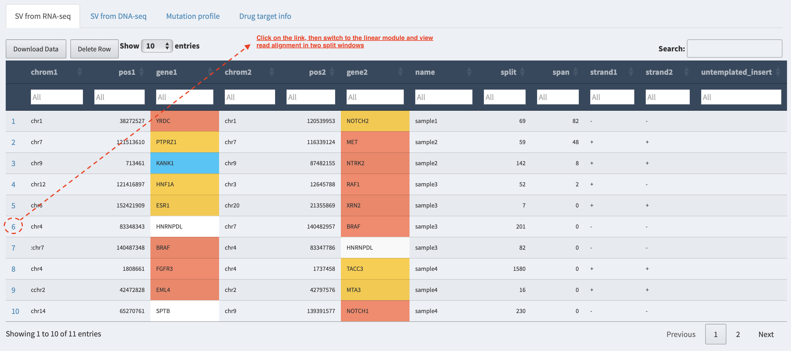
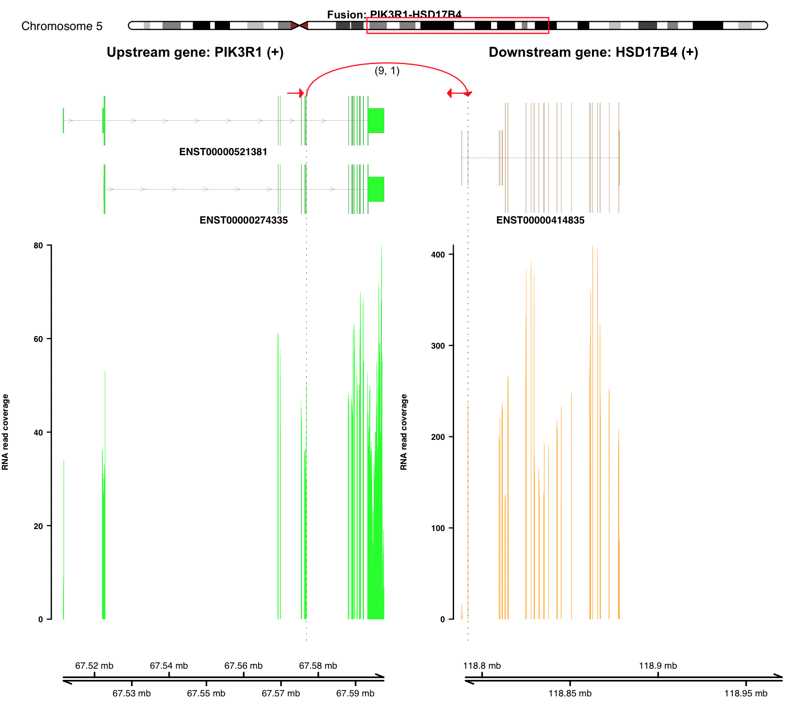

Appendix
--------

Although FuSViz is designed for SV interpretation and visualization of
multiple samples, it could be utilized for single sample analysis
together with read alignments as well. Currently, import read alignment
files is allowed in **Linear** and **Two-way** modules.

Load local alignment file in Linear module
~~~~~~~~~~~~~~~~~~~~~~~~~~~~~~~~~~~~~~~~~~

Alignment and index files need to be uploaded together. For example,
import an RNA-seq alignment in BAM format.

.. figure:: 6.1.Load_local_alignment_track_in_Linear_module_1.png
   :alt: 

Here, a **split-window** mode is used to investigate alignment quality
of split reads or discordant read pairs mapped to different genomic
loci. The read pair highlighted in the dash boxes shows a discordant
mapping feature to partner genes ABHD12B and RCC1, respectively.

Load alignment track from URL address in Linear module
~~~~~~~~~~~~~~~~~~~~~~~~~~~~~~~~~~~~~~~~~~~~~~~~~~~~~~

If alignment data is shared via cloud or hosted in a remote server,
users can load it together with index via URL web address. For example,

.. figure:: 6.2.Load_alignment_track_from_URL_address.png
   :alt: 

Visualize SV event together with read coverage using Two-way module
~~~~~~~~~~~~~~~~~~~~~~~~~~~~~~~~~~~~~~~~~~~~~~~~~~~~~~~~~~~~~~~~~~~

It has to be done under command line (**NOT** available in web
interface) using the function ``plot_separate_individual_bam``. Firstly,
load FuSViz package and genomic annotation object as below:

::

    library(FuSViz)
    options(uscsChromosomeName=FALSE)

Import gene symbol and synonymous names

::

    system_path = path.package("FuSViz")
    extdata = system.file("extdata", package = "FuSViz")

    load(file=file.path(extdata, "ensembl_symbol.Rd"))
    symbol_ensem = gene_id$Gene_name
    names(symbol_ensem) = gene_id$Gene_ID

Set gene/transcript annotation version (e.g. **hg19**; it needs to
change to **hg38** if genomic coordinates of breakpoints come from human
genome reference **hg38**).

::

    version = "hg19"; # or “hg38”

Load gene/transcript annotation object:

::

    txdb = suppressWarnings(suppressPackageStartupMessages(AnnotationDbi::loadDb(file=file.path(extdata, paste("gencode.v36.annotation.", version, ".sqlite", sep="")))))
    load(file=file.path(extdata, paste("grTrack.", version, ".Rd", sep="")))
    load(file=file.path(extdata, paste("cytoband.", version, ".Rd", sep="")))
    whole_txdb = GenomicFeatures::exonsBy(txdb, by = "tx", use.names=TRUE); # group exons by transcript_id

Use ‘plot\_separate\_individual\_bam’ to visualize fusion together with RNA-seq read coverage
^^^^^^^^^^^^^^^^^^^^^^^^^^^^^^^^^^^^^^^^^^^^^^^^^^^^^^^^^^^^^^^^^^^^^^^^^^^^^^^^^^^^^^^^^^^^^

For example, plot a fusion event of “PIK3R1-HSD17B4”

::

    rna_bam_path=file.path(extdata, "RNA-seq-example.bam")
    plot_separate_individual_bam(first_name = "PIK3R1", second_name = "HSD17B4", breakpoint_A = 67576834, breakpoint_B = 118792010, coverage_plot_trans = F, rna_bam_path = rna_bam_path, split = 9, span = 1, fusion_strandA="+", fusion_strandB="-")

.. figure:: 6.3.fusion_RNA-seq_1.png
   :alt: 

From the top it shows the position of partner genes in a chromosome
ideogram, the fusion event (a curved line marked by read support (9 -
split read, 1 – spanning read pair); arrow indicates transcribed
direction of the fusion), exon annotations of different transcript
isoforms for upstream (colored by **green**) and downstream (colored by
**orange**) partners, RNA expression levels measured by read counts and
genomic coordinates of partner gene loci in Mb from chromosome.

Visualize fusion with RNA-seq read coverage calculated by specific transcript isoforms
^^^^^^^^^^^^^^^^^^^^^^^^^^^^^^^^^^^^^^^^^^^^^^^^^^^^^^^^^^^^^^^^^^^^^^^^^^^^^^^^^^^^^^

::

    plot_separate_individual_bam(first_name = "PIK3R1", second_name = "HSD17B4", breakpoint_A = 67576834, breakpoint_B = 118792010, coverage_plot_trans = T, rna_bam_path = rna_bam_path, transcriptA="ENST00000521381", transcriptB="ENST00000414835", split = 9, span = 1, fusion_strandA="+", fusion_strandB="-")

``coverage_plot_trans = T`` suggests RNA-seq read coverage is measured
using the chosen transcripts **ENST00000521381** and
**ENST00000414835**.

Visualize fusion with both RNA-seq and DNA-seq read coverage
^^^^^^^^^^^^^^^^^^^^^^^^^^^^^^^^^^^^^^^^^^^^^^^^^^^^^^^^^^^^

::

    dna_bam_path=file.path(extdata, "DNA-seq-example.bam");
    plot_separate_individual_bam(first_name = "PIK3R1", second_name = "HSD17B4", breakpoint_A = 67576834, breakpoint_B = 118792010, coverage_plot_trans = F, chrom_notation_rna = T, chrom_notation_dna = F, split = 9, span = 1, rna_bam_path = rna_bam_path, dna_bam_path = dna_bam_path, fusion_strandA="+", fusion_strandB="-")

Read alignment BAM file from DNA-seq can be whole genome sequencing,
Exome-seq or gene-panel target sequencing. ``chrom_notation_rna = T``
suggests the chromosome notation in RNA-seq alignment file is named like
**'chrX'** (i.e. UCSC syntax); ``chrom_notation_dna = F`` denotes the
chromosome notation in DNA-seq alignment file is named like **'X'**
(i.e. ensembl syntax).

A full usage of ‘plot\_separate\_individual\_bam’
^^^^^^^^^^^^^^^^^^^^^^^^^^^^^^^^^^^^^^^^^^^^^^^^^

See reference, ``?plot_separate_individual_bam``
