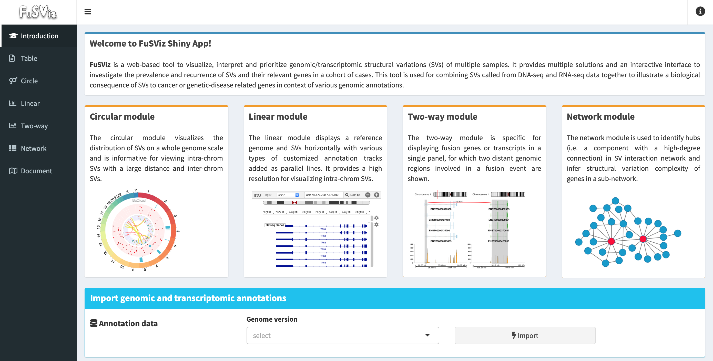

## Introduction

### About

*FuSViz* is a web-browser based tool to visualize, interpret and prioritize genomic/transcriptomic structural variations (SVs) of a sample cohort. It provides multiple solutions and an interactive user interface to investigate the prevalence and recurrence of SVs and their relevant genes in a cohort. The tool is designed for combining SVs called from DNA-seq (e.g. whole genome or target exome) and RNA-seq data to illustrate a biological implication of SVs to the partner genes and interested genomic regions in context of various annotations, and it can integrate a mutation profile (SNVs/Indels) to reveal a connection between small variants and complex genomic aberrations as well. The implementation of this tool facilitates to explore and report both recurrent and private SVs, potentially assisting with pathogenesis and biomarker discovery in cancer genomic research.

User interface overview of *FuSViz* dashboard:

### Why to use *FuSViz*?

The tool is attempting to address the following questions:

1. Implement multiple visualization solutions to analyze and interpret SVs in a systematic way, with an emphasis on an integration of SVs from DNA-seq and RNA-seq data.

2. Quality control (QC) of SVs via read alignment; identify and filter possible artifacts; prioritize SVs with a high confidence.

3. Highlight and rank cancer-relevant genes (e.g. proto-oncogenes or tumor suppressor genes) that are enriched in SV events.

4. Explore the distribution of SVs across samples, identify samples with a hyper-SV event, and see whether there is a correlation between small variant mutation and SV burden?

5. Search for highly prevalent and recurrent SVs in sample cohort; reveal their molecular mechanisms and biological consequences in context of various genomic annotations (e.g. exon-intron structure, promoters and enhancers, topologically associating domain (TAD)).

6. Investigate the distribution of breakpoints; identify potential hotspot regions; see whether there is an association between mutation and breakpoint hotspots?

7. Which SV event is dominant in fusion gene/transcript variants; predict an outcome of chimeric transcript (e.g. an in-frame ORF encodes a fusion protein with informative domains).

8. Identify hubs in SV interaction network; infer structural variation complexity of gene in a sub-network.

9. Generate high quality figures of SVs for publication.

### Citation

COMING SOON

### Contact

senz AT ifi.uio.no

