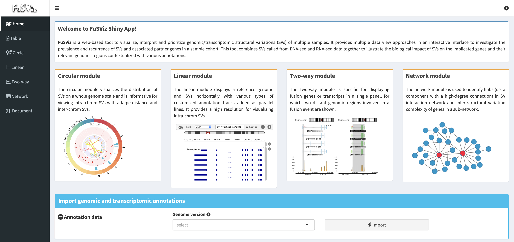

Introduction
------------

About
~~~~~

**FuSViz** is a web-based tool to visualize, interpret and prioritize
genomic/transcriptomic structural variations (SVs) of multiple samples.
It provides multiple solutions and an interactive user interface to
investigate the prevalence and recurrence of SVs and their relevant
genes in a cohort of cases. The tool is designed for combining SVs
called from DNA-seq (e.g. whole genome or target exome) and RNA-seq to
illustrate a biological implication of SVs to the host genes and
interested genomic regions in context of various annotations, and it can
also integrate a mutation profile (SNVs/Indels) to reveal a connection
between small variants and complex genomic aberrations. Importantly,
this tool facilitates to explore and report both common and rare changes
of molecular signatures related to cancers or human genetic diseases.

User interface overview of **FuSViz** dashboard:

Why to use FuSViz?
~~~~~~~~~~~~~~~~~~

The tool is attempting to address the following questions:

1. Assemble multiple visualizing solutions to analyze and interpret SVs
   in a systematic way, with an emphasis on an integration of SVs from
   DNA-seq and RNA-seq data.

2. Quality control (QC) of SVs via read alignment; identify and filter
   possible artifacts; prioritize SVs with a high confidence.

3. Highlight and rank cancer-relevant genes (e.g. proto-oncogenes or
   tumor suppressor genes) that are enriched in SV events.

4. Explore the distribution of SVs across samples, and identify the
   sample with hyper-SV events. Is there a correlation between small
   variant mutations and SVs burden?

5. Search for high prevalent and recurrent SVs in a cohort of samples;
   reveal their molecular mechanisms and biological consequences in
   context of various genomic annotations (e.g. exon-intron structure,
   promoters and enhancers, topologically associating domain (TAD)).

6. Investigate the distribution of breakpoints; identify potential
   hotspot regions; is there any association between mutation and
   breakpoint hotspots?

7. Which SV event is dominant in forming fusion genes/transcripts;
   predict an outcome of chimeric transcript (e.g. an in-frame ORF
   encoding a fusion protein with combined domains).

8. Identify hubs in SV interaction network; infer structural variation
   complexity of gene in a sub-network.

9. Generate publication-quality figures of SVs with various annotation
   tracks.

Citation
~~~~~~~~

COMING SOON

Contact
~~~~~~~

senz AT ifi.uio.no
