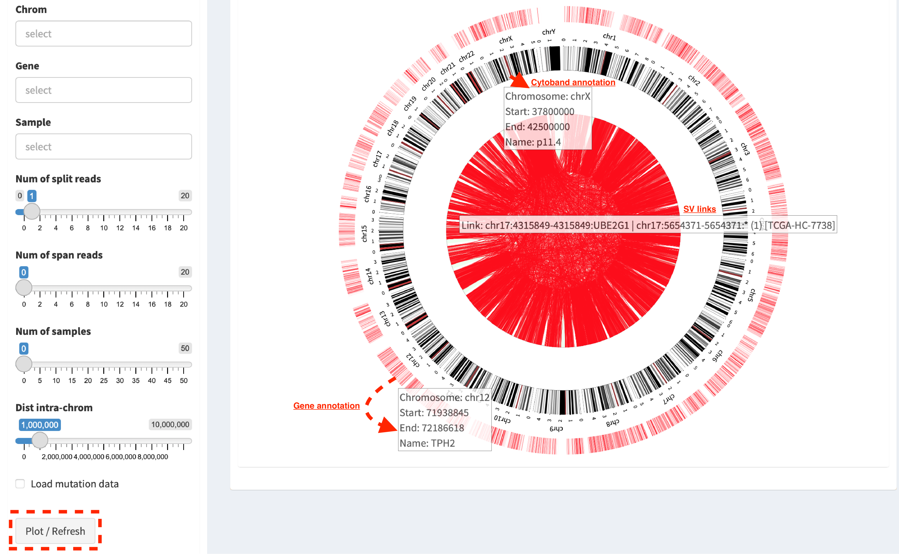

## Usage manual

### Load genomic annotations and input files


#### Running offline

In general, the initiation of IGV browser session in FuSViz **linear module** needs an internet connection because required genome files for igv.js loading are hosted in a cloud server remotely. If users would like to run FuSViz on a system that has **no internect connection**, there are a few extra steps required to make it work. Firstly, users have to download the genome reference, its index file and cytoband annotation locally.

* For human genome version hg19: 
	* *hg19.fasta* - https://s3.amazonaws.com/igv.broadinstitute.org/genomes/seq/hg19/hg19.fasta
	* *hg19.fasta.fai* - https://s3.amazonaws.com/igv.broadinstitute.org/genomes/seq/hg19/hg19.fasta.fai
	* *cytoband.txt* - https://s3.amazonaws.com/igv.broadinstitute.org/genomes/seq/hg19/cytoBand.txt
* For human genome version hg38 (files need to be renamed or unzipped after downloading):
	* *hg38.fasta* (renamed) - https://s3.amazonaws.com/igv.broadinstitute.org/genomes/seq/hg38/hg38.fa
	* *hg38.fasta.fai* (renamed) - https://s3.amazonaws.com/igv.broadinstitute.org/genomes/seq/hg38/hg38.fa.fai
	* *cytoBandIdeo.txt* (unzip) - https://s3.amazonaws.com/igv.org.genomes/hg38/annotations/cytoBandIdeo.txt.gz

1. Select an offline mode in `Genome version` box


2. Upload a genome reference (e.g. *hg19.fasta*), an index file (e.g. *hg19.fasta.fai*) and a cytoband annotation (e.g. *cytoBand.txt*) in `Upload a file` box in **linear module**


3. Load gene annotation track, i.e. press `Load gene track (offline)` button in **Linear module**


Now, the offline IGV browser session is launched successfully (for its usage, see **Linear module** section below).


#### FuSViz annotation resources

Annotations with human genome version hg19 and hg38 are provided, and they include:

* The gene, transcript and exon annotations (**ENSEMBL Release 104** gene annotation on reference chromosomes for [hg38](http://may2021.archive.ensembl.org/index.html)) and (**ENSEMBL Release 87** gene annotation on reference chromosomes for [hg19](http://grch37.ensembl.org/index.html)). NOTE: scaffolds and contigs are excluded in FuSViz analysis.
* [Chromosome cytobands from UCSC Genome Browser](http://genome.ucsc.edu/cgi-bin/hgTables?db=hg38&hgta_group=map&hgta_track=cytoBand&hgta_table=cytoBand&hgta_doSchema=describe+table+schema)
* Gene symbol and synonymous names - the resource for approved human gene nomenclature [HGNC](https://www.genenames.org/download/statistics-and-files/) were downloaded using ENSEMBL [BioMart API service](http://may2021.archive.ensembl.org/biomart/martview/7785a5b8efc47c501607d147bae28b59)
* Protein domains and motifs are from [InterPro](https://www.ebi.ac.uk/interpro/download/) database v86. NOTE: InterPro integrates signatures of several databases (e.g. CDD, Pfam, SMART, Prosite and MobiDB). In terms of different sources, domain length, structure and name may be incongruent. Domains with overlapping intervals are merged and the most common name represents its entry.
* Literature-mined database of tumor suppressor genes/proto-oncogenes – [CancerMine](http://bionlp.bcgsc.ca/cancermine/) v42. NOTE: status of proto-oncogenes and tumor suppressor genes are determined according to the following protocol:
	a. A given gene with the support of at least two literatures that suggests an oncogenic or tumor suppressor role.
	b. **A one-way fisher exact test** on the number of literatures with support evidence as proto-oncogene or tumor suppressor gene. If `pvalue <= 0.05`, `0.05 < pvalue < 0.95` and `pvalue >= 0.95`, _oncogene_, _cancer-related gene_ or _tumor suppressor gene_ is tagged, respectively.
	c. Proto-oncogenes/tumor suppressor candidates from CancerMine that were found in the curated list of false positive cancer drivers defined by [Bailey et al, Cell 2018](https://www.ncbi.nlm.nih.gov/pubmed/30096302) are excluded.
* Drug target entry association with cancer from [Open Targets Platform](https://www.targetvalidation.org/) - Database of molecularly targeted drugs and tractability aggregated from multiple sources (literature, pathways and mutations), release 2021-02-01.

#### Import SV and mutation files

In `Input` section, input format for FuSViz and how to prepare these input files are documented.

### Table overview of import data

Imported RNA and DNA SV calls and mutation profile are demonstrated in tab panels `SV from RNA-seq`, `SV from DNA-seq` and `Mutation profile`, respectively.

#### Table – sorting, filtering and prioritizing SVs


For example, in `SV from DNA-seq` tab panel, genes involved in SVs are highlighted by **red**, **blue** and **orange** if they are *proto-oncogenes*, *tumor suppressor genes* and *cancer-related genes*.

#### Wordcloud – prevalence of SV-related genes across samples


In `SV relevant gene wordcloud` tab panel, the popup number when mouse over a word shows the frequency of SV partner gene in a cohort of samples (e.g. *TMPRSS2*: 52). Font size of a word is adjusted via `Word size` slider; the number of words displayed in layout is controlled via `Gene freq` slider (words rendered with frequency >= selected value); shape of wordclould is customized via `Word shape` select box (options: 'circle', 'square' and 'cardioid').

#### Histogram – SV distribution across samples


In `SV distribution across samples` tab panel, histogram plots the total number of SVs per sample which is used to identify any hyper-SV sample. For SV calls from DNA-seq, the frequency of each SV type per sample is plotted as well and it shows whether there is a preference of SV to any specific category. Font size of sample name is adjusted via `Font size` slider; position of sample name is changed vertically via `X-axis pos` slider; position of sample name is rotated via `X-axis rotate` slider, bar space between samples is controlled via `Bar space` slider.

#### Correlation - small variant mutations and SVs burden


In `Correlation of mutation and SV(DNA-seq) burden` tab panel, the relationship between small variant mutations and SVs burden is plotted if variant mutation profile is available. Mutation and SV burden for a selected sample (e.g. dot in a dashline box) is shown in a table below (the value is _log2_ transformed).

#### Drug target association with cancer-related genes


In `Drug target info` tab panel, genes involved in RNA-seq/DNA-seq SVs with an entry in [Open Targets Platform](https://www.targetvalidation.org/) database are listed in a table with drug targeting annotation (e.g. `molecular_chembl_id` - available antineoplastic drug with [ChEMBL](https://www.ebi.ac.uk/chembl/) compound identifier; `target_chembl_id` - [ChEMBL](https://www.ebi.ac.uk/chembl/) compound identifier of the targeted gene; `interactive_type` - an interactive way of drug to the target gene).

### Circular module

Circular plot analyses of RNA-seq and DNA-seq SVs are demonstrated in `RNA_SV_circular_plot` and `DNA_SV_circular_plot` tab panels, respectively. A few examples are shown below:

#### Whole genome SVs overview



Press button `Plot / Refresh`. Circular tracks displayed from outside to inner are **Gene annotation**, **Cytoband annotation** and **SV links**, respectively. For a pop-up window of one SV link (mouse over), it denotes like `Link: chr17:4315849-4315849:UBE2G1 | chr17:565471-565471:* (1) [TCGA-HC-7738]`, i.e. the breakpoint at chr17:4315849 (within gene UBE2G1) is linked to the breakpoint at chr17:565471 (in an intergenic region, marked by \*), which is present in one sample (TCGA-HC-7738).

#### Demo SVs with customized settings

Users could change the settings in `RNA_SV_panel` or `DNA_SV_panel` for a customized analysis.


Press button `Plot / Refresh` after selecting `Gene` *ERG*. It plots SV events of *ERG* gene and its relevant chromosomes (e.g. chromosome 1, 4, 8, 10, 18 and 21). More customized investigations are made by choosing in `Chrom` or `Sample` boxes.


Another example - an overview of SVs in sample “TCGA-HC-A6AP” after filtering out intra-chromosome SVs with a distance < 9Mb (NOTE: slider `Dist intra-chrom` is specific for filtering out intra-chromosome SVs with a distance less than that given value).


By changing the value of `Num of samples` slider, the most recurrent SVs (>35 samples) in the cohort of samples are displayed.

#### Integrate SVs and mutation data


Click check box `Load mutation data` (as default, mutation types with no-silent consequence are chosen in `Mutation type`, please keep it as empty if all mutation types are included), then click button `Plot / Refresh`. **Mutation profile** track is added between **Cytoband annotation** and **SV links** tracks. As an example shows: 
```
Chromosome:17	Position:49619070	Value:8	Anno:SPOP: A>C(Missense_Mutation)[TCGA-ZG-A9ND, TCGA-XJ-A83G, TCGA-Y6-A8TL, TCGA-G9-6369, TCGA-CH-5788, TCGA-V1-A9OF] | A>G(Missense_Mutation)[TCGA-EJ-5531, TCGA-ZG-A9L6]
```
It denotes that eight samples have a mutation variant at the genomic coordinate "chromosome 17:49619070", in which two different missense mutations (A\>C and A\>G) is found in six and two samples, respectively.

#### Zoom-in circular plot

Two ways are available for zoom-in: using `zoom spinner of the mouse` or `double-click a targeted object`. For example, double-click a mutation dot (marked by arrow line) in the plot for zoom-in:


#### Download circular plot

Press `Download circular plot` will save current page as a htmlwidget.


### Linear module

Linear module is built on basis of an embeddable interactive genome visualization Javascript library [igv.js](https://github.com/igvteam/igv.js). A htmlwidget is created to communicate between R and Javascript, and render the functionality of [igv.js](https://github.com/igvteam/igv.js). As default setting, IGV browser interface is automatically launched by selecting a genome reference version (hg19 or hg38) in `Import genomic and transcriptomic annotations` of Introduction page. SVs are loaded in different types of genomic tracks and are illustrated per each chromosome. Currently, FuSViz accepts four types of tracks (i.e. **bedpe**, **segment**, **bed** and **bedgraph** formats). Users could configure the setting of loaded tracks in `SV_DNA`, `SV_RNA` and `Mut` panels.

#### Load SVs in "bedpe" format (available for DNA-seq and RNA-seq SVs)


Press `Load DNA SV track in bedpe` button, intra-chromosome SVs are denoted as curves that link breakpoint sites. After clicking a curve, a pop-up window with a feature description of the selected SV, e.g.  

* `Region1: chr17 19901107-19901107` - breakpoint site/interval of first end of SV
* `Region2: chr17 63545711-63545711` - breakpoint site/interval of second end of SV
* `Name: TCGA-EJ-A8FS` - sample name
* `Score: 1` - the number of samples has such SV
* `Type: INV` - SV type as inversion

Some options in panel setting are used to filter and prioritize SVs (e.g. `Min_Dist` and `Max_Dist` for filtering out SV with a distance out of a range; `SV_type` and `Sample` for prioritizing SVs of selected types or samples). Users can adjust the layout of bedpe track via configuration panel (e.g. `Set track height`).

#### Load SVs in "segment" format (only available for DNA-seq SVs)


Press `Load DNA SV track in seg` button, two types of SVs (i.e. **duplication** and **deletion**) representing copy number aberrations (CNAs) are displayed, in which **duplication** and **deletion** of genomic segments are colored by **red** and **blue** bars, respectively. A pop-up window with feature description of the clicked bar, e.g.  

* `chr: chromosome` - chromosome name
* `start: 218326007` - start coordinate of segment interval
* `end: 221142594` - end coordinate of segment interval
* `value: 1` (**duplication**) / `-1` (**deletion**)
* `sample: TCGA-HC-7738` - sample name

Here, the layout of seg track is shown as `Expand` mode (default value in `Sample Height` setting). Users can adjust the size of track via `Set track height` setting or choose `Squish` option in `Sample Height` setting to display all samples in configuration panel. An example below,


If users are interested in CNAs overlapping/within a target region, a subset of **duplication** and **deletion** are displayed via setting of `Chrom`, `Start` and `End` options (e.g. "chr21:38990663-40450349") in `SV_DNA` panel.


#### Load SVs in "bed" and "bedgraph" format (available for DNA-seq and RNA-seq SVs and mutation profile)


Press `Load DNA SV breakpoints` (or `Load RNA SV breakpoints`) button, SV breakpoint tracks in bed (upper – colored by **green**) and bedgraph (below – colored by **blue**) format are loaded together. In bed format track, click a breakpoint and its feature description pops up like:

* `Name: TCGA-V1-A9OF` - sample name 
* `split: 7` - the number of split read support  
* `span: 29` - the number of discordant read pair support  
* `Type: DEL` - SV type as deletion  
* `Partner_chr: chrX` - the chromosome on which the other breakpoint of SV is located  
* `Partner_start` and `Partner_end: 48673055 and 48673059` - the zero-based starting and one-based end position of the other breakpoint of the SV on `Partner_chr`  
* `chrX: 95551524-95551528` - the chromosome, zero-based starting and one-based end position of the clicked SV breakpoint  

Bedgraph tracks display the frequency of recurrent breakpoints across samples. After clicking one peak, a pop-up window shows the number of frequency (e.g. `value: 1`) of breakpoint (e.g. `Position: 57040074-57040076`).

Importantly, breakpoint hotspot regions (highlighted in dashline boxes) can be identified in bed and bedgraph tracks. For example, a recurrent inversion between `chrX:2197061-2197064` and `chrX:48672810-48672813` is corresponding to marked breakpoint hotspots (see below).


#### Upload user-defined annotation files

Users are allowed to upload customized annotation files in **VCF** (e.g. genetic variations), **BED** (e.g. regulatory elements - enhancers and TADs) and **GTF** (e.g. genes, transcripts, exons) formats to interpret SV patterns. Some requirements of a customized annotation file:

* Chromosome name **MUST** start with "chr"
* All upload files **MUST** be sorted by chromosome and genomic coordinate, then compressed and indexed using [bgzip](http://www.htslib.org/doc/tabix.html) and [tabix](http://www.htslib.org/doc/tabix.html)
* The compressed file **MUST** upload together with its index file
* Make sure genomic coordinate in upload annotation files **MUST** be the same version as used in IGV browser

For example, upload a gene annotation file in GTF format from GENCODE v35 and compare it with the default annotation track (NCBI RefSeq).


In addition, read alignment files (e.g. **BAM** or **CRAM** format) can be uploaded for sample analysis (see **Appendix** section for usage and case example). 

#### Display genomic coordinate of current window

Press `Show coordinate` button


#### Save and download tracks

IGV browser provides a button `Save SVG` to download loaded tracks as SVG format for publication quality figure.


#### Illustrate SV pattern by combining multiple tracks together

##### Example 1: identify recurrent duplications involving an upstream enhancer of AR gene

Loaded tracks from the top denote chromosome ideogram, gene annotation (NCBI RefSeq), SV in segment format (**Duplication** and **Deletion**), SV in bedpe format and user-defined bed file (enhancers_sort.bed.gz). Dashline box highlights a highly recurrent duplication of an upstream enhancer *GHXI66900* of *AR* gene in a cohort of samples.


##### Example 2: a comparison of breakpoint distribution at DNA and RNA level

In loaded SV tracks from DNA-seq data, breakpoints within *TMPRSS2* and *ERG* (highlighted in grey boxes) show a scatter distribution, and no peak indicates a high recurrence. While breakpoints of SVs related to these two genes at RNA level are distributed at a few exon-exon boundaries with a high recurrent frequency. As introns constitute most of a gene in length and are enriched in breakpoints compared to exons, RNA splicing mechanism make most transcribed breakpoints aligned to exon boundary, simplifying the complexity of SVs in the RNA-seq data. As expected in bedpe track, fusion events of *TMPRSS2-ERG* detected from RNA-seq in general link the splicing sites of two partner genes.


### Two-way module (RNA-seq)

Two-way module is designed for analysis of a specific SV type (i.e. fusion gene/transcript) in a single panel, where two distant genomic intervals involved in a few fusion events are shown together with gene annotations. Three functional panels (i.e. `Overview_plot`, `Sample_plot` and `Domain_plot`) are provided to investigate fusion events in different dimensions.

#### Overview_plot (only available for RNA-seq SVs)

It displays all fusion events related two partner genes and their recurrent frequency in a cohort of samples. In an example below, choose partner gene names (e.g. *TMPRSS2* and *ERG*) in Select boxes `GeneA (*)` and `GeneB (*)` of setting panel, and press `Plot / Refresh`. The two-way plot view is from the top showing fusion events (curved lines with occurrence value in brackets), exon annotations of different transcript isoforms for upstream (colored by **green**) and downstream (colored by **orange**) partners, genomic coordinates of partner gene loci in Mb from chromosome, partner gene position in a chromosome ideogram.


Show the fusions of chosen breakpoints in Select boxes `Breakpoint A` and `Breakpoint B`. For example, breakpoint `41507950` of *TMPRSS2* is chosen; three fusion events with recurrent frequency (`3`, `42` and `17`) are plotted on the top of two-way plot view (highlighted in dashline box).


Show annotations of chosen transcripts in Select boxes `GeneA transcript` (`ENST00000679263` and `ENST00000679054`) and `GeneB transcript` (`ENST00000398910` and `ENST00000398919`), and filter out the fusion event with the number of split reads less than 8 (see the setting of `Num of split reads` slider).


Users could add a vertical baseline by click-on check box `Ruler line:` to have a clear view to the annotation of an breakpoint in context of 'exon-intron' structure for different transcript isoforms.


Zoom in/out and download plot


#### Sample_plot (only available for RNA-seq SVs)

It illustrates a specific fusion event between two partner genes of one sample in context of transcript isoform annotations. To make a plot, the `GeneA`, `GeneB`, `Breakpoint A`, `Breakpoint B` and `Sample` must be selected. For example, the demo case below is from the top showing the position of partner genes in a chromosome ideogram, the fusion event (a curved line with number of split and span reads in bracket), exon annotations of different transcript isoforms for upstream (colored by **green**) and downstream (colored by **orange**) partners in which fusion parts are highlighted by grey box, genomic coordinates of partner gene loci in Mb from chromosome.


As a breakpoint has a various annotation (e.g. 'at exon boundary', 'within exon' or 'within intron') in terms of different transcript isoforms, users can choose the most relevant transcript in Select boxes `GeneA` and `GeneB transcript` (e.g. `ENST00000679054` and `ENST00000417133`) to demonstrate the fusion event.


For plotting read coverage using alignment file in a single sample analysis, see **Appendix** section.

#### Domain_plot (only available for RNA-seq SVs)

Domain plot shows a biological consequence of chimeric transcript in context of protein domain and motif annotations. For example, after choosing partner genes (*TMPRSS2* and *ERG*) in Select boxes `GeneA` and `GeneB`, transcript isoforms with any domain and motif annotations are bold in Select boxes `TranscriptA` and `TranscriptB`. Choose relevant ones, then press `Activate` button.


In plot view panel, motif & domain annotations and the selected transcripts with concatenated exons for GeneA (colored by **green**) and GeneB (colored by **orange**) are shown in upper and lower half layout, respectively. Colored arrow lines denote different biological consequence of translated chimeric transcripts (i.e. `red: outframe`, `blue: inframe`, `'#008080': truncate-loss`, `black: unknown`).

Show biological consequence of a specific chimeric transcript with the selected breakpoints (e.g. `41498119` and `38423561` are chosen in Select box `Breakpoint A` and `Breakpoint B`, see below).


### Network module

The aim of this module is to identify a hub (i.e. a node with a high degree of connection) in SV interaction network and reveal the impact of SV events on functionality of involved genes. SVs with at least one breakpoint within the pre-defined **cancer** geneset (from CancerMine) are included the analysis. In the network, *node* represents either a gene or an intergenic interval that harbors breakpoints of SVs; while *edge* shows interactive SVs events between two nodes. The results are presented in four functional panels (`RNA_SV_network_plot`, `RNA_SV_network_hub`, `DNA_SV_network_plot` and `DNA_SV_network_hub`).

#### DNA_SV_network_plot
Press `Plot / Refresh` button in `DNA_SV_panel` settings. An overview of DNA SV interaction network is plotted.


Choose a node name (e.g. *TP53*) in Select box `Node search` of `DNA_SV_panel`, then *TP53* is centralized by its connected nodes. The degree of *TP53* (which is listed in `DNA_network_hub` panel) suggests its structural variation complexity in a cohort of samples. All nodes are marked by five different colors (`red: oncogenes`, `blue: tumor suppressor genes`, `orange: cancer-related genes`, `grey: the other genes`, `black: intergenic` - one breakpoint at intergenic regions). In terms of a tumor suppressor feature and a high degree of connection, an outcome of SVs involving *TP53* most likely results in a loss of function through breaking up the gene.


The gene name pops up after clicking a node in the network plot. User could adjust font size and position of gene name using Numeric Input box `Node font size` and `Node font pos` of `DNA_SV_panel`. The thickness of an edge indicates the number of samples supporting SV event between nodes, and mouseover an edge pops up the value of sample number (e.g. `Num_sample: 1`). The length of edge is adjusted by Numeric Input box `Spring Constant` (i.e. the smaller value, the longer edge).

For another example, choose *ERG* in Select box `Node search`, then a more complex sub-network is shown. In addition to *ERG*, three other hubs (*ETV1*, *SLC45A3* and *TMPRSS2*) with a degree of 8, 6 and 10 (see `DNA_SV_network_hub` panel) are highlighted in dash box. They are enriched in SVs and highly interact with each other, which consist of a functional module. Of them, the *TMPRSS2-ERG* has an occurrence in 22 samples (see a pop-up window). Importantly, all the four hubs are **oncogenic** features, and it is interesting to see whether DNA SV events can form fusion transcripts at RNA level.


#### RNA_SV_network_plot

Press `Plot / Refresh` button in `RNA_SV_panel` setting. An overview of RNA SV interaction network is plotted, which looks very similar to the `DNA_SV_network_plot` except for edges with arrow lines. As most SV events observed at RNA level are transcribed as fusion transcripts, an arrow indicates the transcription direction from upstream to downstream partner.


Choose *ERG* in Select box `Node search` of `RNA_SV_panel`, then the sub-network with centralized *ERG* is focused on. Four hubs (*ERG*, *SLC45A3*, *ETV1* and *TMPRSS2* colored as **oncogenes**) highlighted in dashline boxes are identified. RNA fusions, as indicated by arrows, may give rise to an increase of downstream partner expression (e.g. *ERG* and *ETV1*) due to a "hitchhiking effect" of overexpressed upstream partner (e.g. *TMPRSS2* and *SLC45A3*) or an enhanced activity of partner gene with onco- feature due to a combination of protein domains.


#### DNA_SV_network_hub and RNA_SV_network_hub

A table summarizes network centrality/hub scores. The `nodes` column is marked by three colors (`red: oncogenes`, `blue: tumor suppressor genes` and `orange: cancer-related genes`). Two different values, `degree` and `score`, represent the number of edges linking to a node and the number of samples involving SV events for a node, respectively. By ranking table via `degree` and `score`, users could identify the hub with high structural variation complexity.


#### Download

The network is saved as png format by pressing `Export as png` button. In general, `Display Navigation` is clicked out in order to download a full view of plot.


