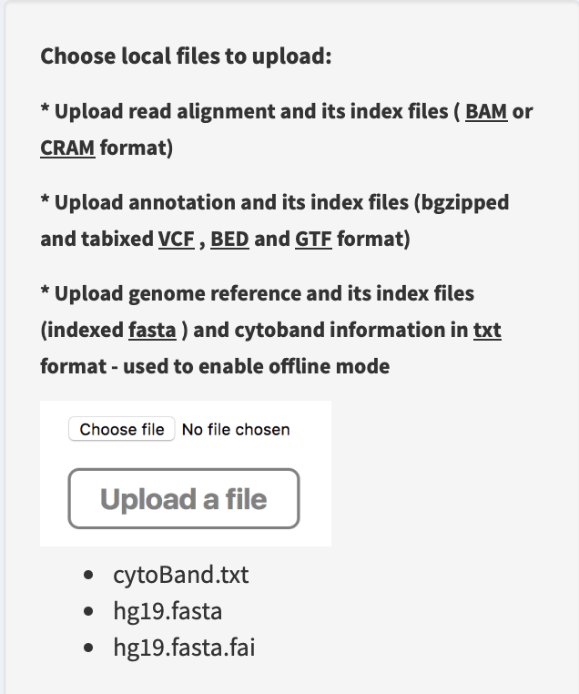
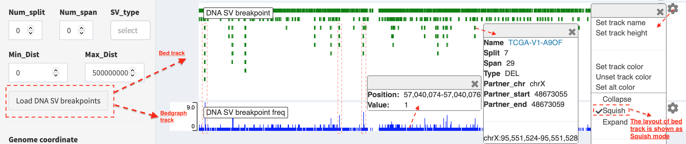
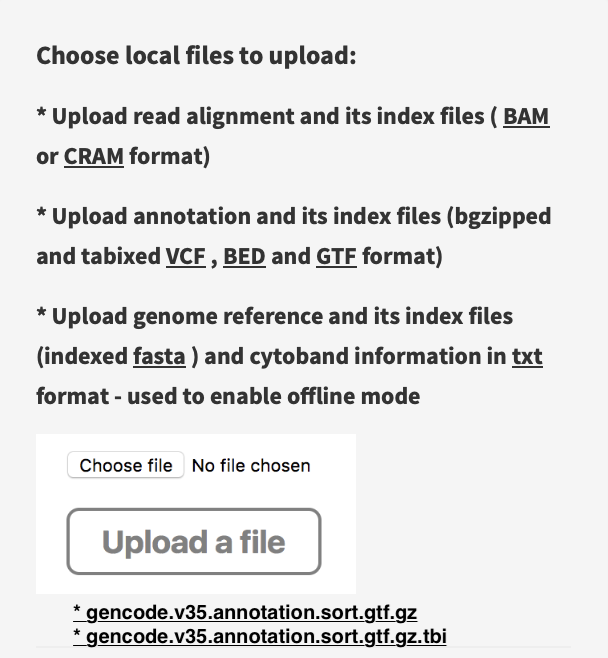
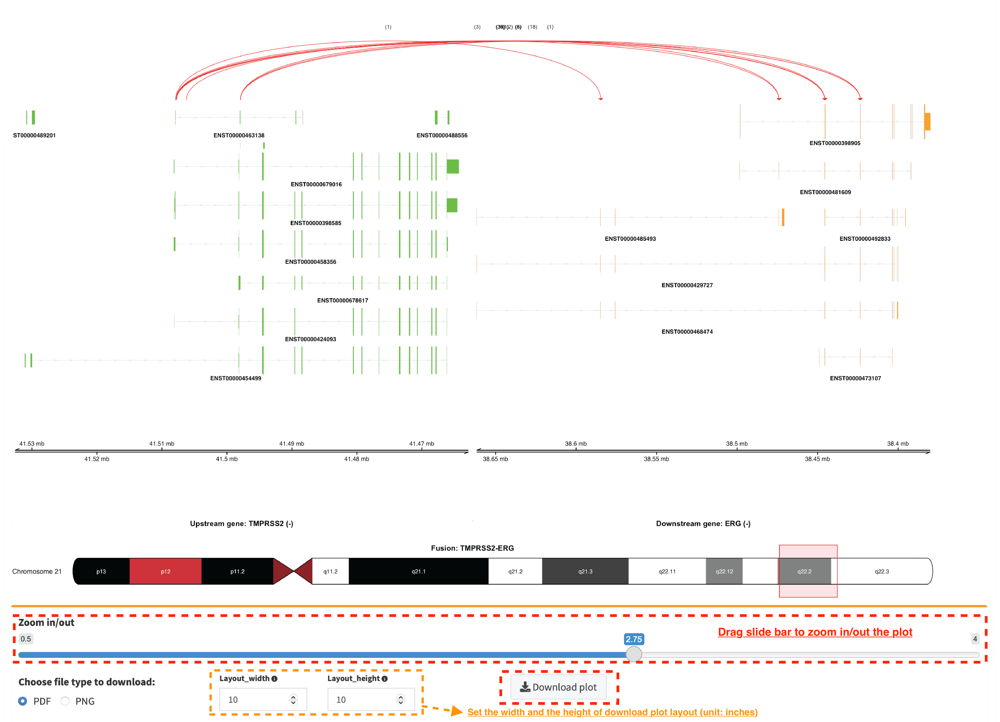

## Usage manual

### Load genomic annotations and input files


#### Running offline

By default, the initiation of IGV browser in *FuSViz* **linear module** needs an online environment. However, with some additional configurations, it is able to run *FuSViz* on an offline system. Users will need to manually upload pre-defined genome reference and index files, and cytoband annotation for launching the IGV session.

* For human genome version hg19: 
	* *hg19.fasta* - https://s3.amazonaws.com/igv.broadinstitute.org/genomes/seq/hg19/hg19.fasta
	* *hg19.fasta.fai* - https://s3.amazonaws.com/igv.broadinstitute.org/genomes/seq/hg19/hg19.fasta.fai
	* *cytoband.txt* - https://s3.amazonaws.com/igv.broadinstitute.org/genomes/seq/hg19/cytoBand.txt
* For human genome version hg38 (files need to be renamed or unzipped after downloading):
	* *hg38.fasta* (renamed after download) - https://s3.amazonaws.com/igv.broadinstitute.org/genomes/seq/hg38/hg38.fa
	* *hg38.fasta.fai* (renamed after download) - https://s3.amazonaws.com/igv.broadinstitute.org/genomes/seq/hg38/hg38.fa.fai
	* *cytoBandIdeo.txt* (unzip after download) - https://s3.amazonaws.com/igv.org.genomes/hg38/annotations/cytoBandIdeo.txt.gz

1. Select an offline mode in `Genome version` box


2. Upload a genome reference (e.g. *hg19.fasta*), an index file (e.g. *hg19.fasta.fai*) and a cytoband annotation (e.g. *cytoBand.txt*) via `Upload a file` box in **linear module**



3. Load gene annotation track, i.e. press `Load gene track (offline)` button in **Linear module**


Now, the offline IGV browser session is launched successfully (for the usage, see **Linear module** section below).


#### FuSViz annotation resources

Annotations of human genome version (hg19 and hg38) and mouse genome version (GRCm39) are provided, and they include:

* The gene, transcript and exon annotations (**ENSEMBL Release 104** gene annotation on reference chromosomes for [hg38](http://may2021.archive.ensembl.org/index.html), **ENSEMBL Release 87** gene annotation on reference chromosomes for [hg19](http://grch37.ensembl.org/index.html), **ENSEMBL Release 111** gene annotation on reference chromosomes for [GRCm39](https://jan2024.archive.ensembl.org/Mus_musculus/Info/Index)). NOTE: scaffolds and contigs are excluded in *FuSViz* analysis.
* [Chromosome cytobands from UCSC Genome Browser](http://genome.ucsc.edu/cgi-bin/hgTables?db=hg38&hgta_group=map&hgta_track=cytoBand&hgta_table=cytoBand&hgta_doSchema=describe+table+schema)
* Gene symbol and synonymous names - the resource for approved human gene nomenclature [HGNC](https://www.genenames.org/download/statistics-and-files/) were downloaded using ENSEMBL [BioMart API service](http://may2021.archive.ensembl.org/biomart/martview/7785a5b8efc47c501607d147bae28b59)
* Protein domains and motifs are from [InterPro](https://www.ebi.ac.uk/interpro/download/) database v86. NOTE: InterPro integrates signatures of several databases (e.g. CDD, Pfam, SMART, Prosite and MobiDB). In terms of different sources, domain length, structure and name may be incongruous. Domains with overlapping intervals are merged and the most common name represents its entry.
* Literature-mined database of tumor suppressor genes/proto-oncogenes – [CancerMine](http://bionlp.bcgsc.ca/cancermine/) v42. NOTE: status of proto-oncogenes and tumor suppressor genes are determined according to the following rule:
	a. A given gene with a support of at least two literatures that suggest an oncogenic or tumor suppressor role.
	b. **A one-way fisher exact test** is performed on the number of literatures with an evidence as proto-oncogene or tumor suppressor gene. If `pvalue <= 0.05`, `0.05 < pvalue < 0.95` and `pvalue >= 0.95`, _oncogene_, _cancer-related gene_ or _tumor suppressor gene_ is tagged, respectively.
	c. Proto-oncogenes/tumor suppressor candidates from CancerMine that were found in the curated list of false positive cancer drivers defined by [Bailey et al, Cell 2018](https://www.ncbi.nlm.nih.gov/pubmed/30096302) are excluded.
* Drug target entry association with cancer from [Open Targets Platform](https://www.targetvalidation.org/) - Database of molecularly targeted drugs and tractability aggregated from multiple sources (literature, pathways and mutations), release 2022-02-01.

#### Import SV and mutation files

See `Input` section - requisite input format for *FuSViz* and how to prepare the input file.

### Table overview of import data

Import RNA and DNA SV calls and mutation profile are demonstrated in tab panels `SV from RNA-seq`, `SV from DNA-seq` and `Mutation profile`, respectively.

#### Table – sorting, filtering and prioritizing SVs


For example, in `SV from DNA-seq` tab panel, genes involved in SVs are highlighted by **red**, **blue** and **orange** if they are *proto-oncogenes*, *tumor suppressor genes* and *cancer-related genes*.

#### Table – save the updated table


Users are allowed to edit and update the SV data in table view session (e.g., correct the breakpoint coordinates if the provisional one proves inaccurate, update gene symbol name if necessary and add a comment on the quality of SV).

#### Table – edit and update data


Users are able to output the updated and reviewed SV table into a text file, by clicking on the `Download Data` button.

#### Wordcloud – prevalence of SV-related genes across samples


In `SV relevant gene wordcloud` tab panel, a pop-up window shows the frequency of SV partner genes in sample cohort (e.g. *TMPRSS2*: 52) after mouse over a word. Font size of a word is adjusted via `Word size` slider; the number of words displayed in the layout is controlled via `Gene freq` slider (words with a frequency < selected value are filtered out); shape of wordclould is customized via `Word shape` select box (options: 'circle', 'square' and 'cardioid').

#### Histogram – SV distribution across samples


In `SV distribution across samples` tab panel, histogram plots the number of SVs per sample, which is used to identify any hyper-SV samples. For SV calls from DNA-seq data, the frequency of each SV type per sample is plotted and it shows a distribution of SVs to different categories. Font size of sample name is adjusted via `Font size` slider; position of sample name can be changed vertically via `X-axis pos` slider; position of sample name is rotated via `X-axis rotate` slider; bar space between samples is controlled via `Bar space` slider.

#### Correlation - small variant mutations and SVs burden


In `Correlation of mutation and SV (DNA-seq) burden` tab panel, the relationship between small variant and SV burden is plotted if mutation profile is available. Mutation and SV burden of a selected sample (e.g. dot in a dashline box) is shown in a table below (the value is _log2_ transformed).

#### Drug target association with cancer-related genes


In `Drug target info` tab panel, genes involved in RNA-seq/DNA-seq SVs with an entry in [Open Targets Platform](https://www.targetvalidation.org/) database are listed in a table with drug targeting annotation (e.g. `molecular_chembl_id` - available antineoplastic drug with [ChEMBL](https://www.ebi.ac.uk/chembl/) compound identifier; `target_chembl_id` - [ChEMBL](https://www.ebi.ac.uk/chembl/) compound identifier of the targeted gene; `interactive_type` - an interactive way of drug to the target gene).

### Circular module

Circular plot analyses of RNA-seq and DNA-seq SVs are demonstrated in `RNA_SV_circular_plot` and `DNA_SV_circular_plot` tab panels, respectively.

#### Whole genome SVs overview


Press button `Plot / Refresh`. Circular tracks displayed from outermost to innermost are **Gene annotation**, **Cytoband annotation** and **SV links**. For a pop-up window of one SV link (after mouse over), it shows as `Link: chr17:4315849-4315849:UBE2G1 | chr17:565471-565471:* (1) [TCGA-HC-7738]`, i.e. the breakpoint of UBE2G1 at chr17:4315849 is linked to the breakpoint of an intergenic region (marked by \*) at chr17:565471, and it is present in one sample (TCGA-HC-7738).

#### Demo SVs with customized settings

Users could make a change on the settings of `RNA_SV_panel` or `DNA_SV_panel` for a customized analysis.


Press button `Plot / Refresh` after selecting `Gene` *ERG*. SV events of *ERG* gene and the relevant chromosomes (e.g. chromosome 1, 4, 8, 10, 18 and 21) are plotted. More customized investigations could be done by choosing in `Chrom` or `Sample` box.


Another example - an overview of filtered SVs (intra-chromosome SVs with a distance > 9Mb are kept) in sample “TCGA-HC-A6AP”. NOTE: slider `Dist intra-chrom` is used for filtering out intra-chromosome SV events with a distance less than a given value.


By changing the value of `Num of samples` slider, the most recurrent SVs (>35 samples) in the cohort of samples are displayed.

#### Integrate SVs and mutation data


Click check box `Load mutation data` (by default, mutation types with no-silent consequence are chosen in `Mutation type`; leave it to be empty if all mutation types are included), then click button `Plot / Refresh`. **Mutation profile** track is added between **Cytoband annotation** and **SV links** tracks. An example shows: 
```
Chromosome:17	Position:49619070	Value:8	Anno:SPOP: A>C(Missense_Mutation)[TCGA-ZG-A9ND, TCGA-XJ-A83G, TCGA-Y6-A8TL, TCGA-G9-6369, TCGA-CH-5788, TCGA-V1-A9OF] | A>G(Missense_Mutation)[TCGA-EJ-5531, TCGA-ZG-A9L6]
```
It denotes that eight samples have a mutation variant at the genomic position "chromosome 17:49619070", in which two different missense mutations (A\>C and A\>G) are distributed in six and two samples, respectively.

#### Zoom-in circular plot

Two options are available for zooming in: `spinner of the mouse` or `double-click a targeted object`. For example, double-click a mutation dot (marked by arrow line) in the plot for zooming in:


#### Download circular plot

Press `Download circular plot`, and current page is saved as a htmlwidget.


### Linear module

**Linear module** is built on basis of an embeddable interactive genome visualization Javascript library [igv.js](https://github.com/igvteam/igv.js). A htmlwidget is created to communicate between R and Javascript, and render the functionality of [igv.js](https://github.com/igvteam/igv.js). By default, IGV browser interface is automatically launched by selecting a genome reference version (hg19 or hg38) in `Import genomic and transcriptomic annotations` of Introduction page. SVs can be loaded in different types of genomic tracks and are illustrated per each chromosome. *FuSViz* accepts four types of tracks (i.e. **bedpe**, **segment**, **bed** and **bedgraph** formats). Users could configure the setting of loaded tracks in `SV_DNA`, `SV_RNA` and `Mut` panels.

#### Load SVs in "bedpe" format (available for DNA-seq and RNA-seq SVs)


Press `Load and refresh DNA SV track in bedpe` button, intra-chromosome SVs are denoted as curves that link breakpoint sites. After clicking a curve, a window pops up with a feature description of the selected SV, e.g.  

* `Region1: chr17 19901107-19901107` - breakpoint site/interval of first end of SV
* `Region2: chr17 63545711-63545711` - breakpoint site/interval of second end of SV
* `Name: TCGA-EJ-A8FS` - sample name
* `Score: 1` - the number of samples has this SV
* `Type: INV` - SV type as inversion

Some options in the panel are used to filter and prioritize SVs (e.g. `Min_Dist` and `Max_Dist` for filtering out SV with a distance out of a given range; `SV_type` and `Sample` for prioritizing SVs of selected types or samples). Users can adjust the layout of bedpe track via configuration panel (e.g. `Set track height`).

#### Load SVs in "segment" format (only available for DNA-seq SVs)


Press `Load and refresh DNA SV track in seg` button, two types of SVs (i.e. **duplication** and **deletion**) representing copy number aberrations (CNAs) are displayed, in which **duplication** and **deletion** of genomic segments are colored by **red** and **blue** bars, respectively. A window pops up with a feature description of the clicked bar, e.g.  

* `chr: chromosome` - chromosome name
* `start: 218326007` - start coordinate of segment interval
* `end: 221142594` - end coordinate of segment interval
* `value: 1` (**duplication**) / `-1` (**deletion**)
* `sample: TCGA-HC-7738` - sample name

Here, the layout of seg track is set as `Expand` mode (default value) in the configuration and user is able to choose `Squish` option to show **duplication** and **deletion** events in a compact way. For a customized adjustment of the track size, it can be done via `Set track height` setting. An example below,


If users are interested in CNAs overlapping/within a target region, a subset of **duplication** and **deletion** are displayed by the setting of `Chrom`, `Start` and `End` options (e.g. "chr21:38990663-40450349") in `SV_DNA` panel.


#### Load SVs in "bed" and "bedgraph" format (available for DNA-seq and RNA-seq SVs)



Press `Load and refresh DNA breakpoints in bed` (or `Load and refresh RNA breakpoints in bed`) button, SV breakpoint tracks in bed (upper – colored by **green**) and bedgraph (below – colored by **blue**) format are loaded together. In bed format track, a window pops up after clicking a breakpoint:

* `Name: TCGA-V1-A9OF` - sample name
* `split: 7` - the number of split read support
* `span: 29` - the number of discordant read pair support
* `Type: DEL` - SV type as deletion  
* `Partner_chr: chrX` - the chromosome on which the other breakpoint of SV is located  
* `Partner_start` and `Partner_end: 48673055 and 48673059` - the zero-based starting and one-based end position of the other breakpoint of the SV on `Partner_chr`  
* `chrX: 95551524-95551528` - the chromosome, zero-based starting and one-based end position of the clicked SV breakpoint  

Bedgraph tracks display the frequency of recurrent breakpoints across samples. After clicking one peak, the frequency (e.g. `value: 1`) of a breakpoint (e.g. `Position: 57040074-57040076`) is shown in a pop-up window.

Bed and bedgraph tracks could be used for an identiification of breakpoint hotspot regions (see breakpoint hotspots highlighted in dashline boxes, which links a recurrent inversion between `chrX:2197061-2197064` and `chrX:48672810-48672813`).


#### Upload user-defined annotation files

Users are allowed to upload customized annotation files in **VCF** (e.g. genetic variations), **BED** (e.g. regulatory elements - enhancers and TADs) and **GTF** (e.g. genes, transcripts, exons) formats to interpret SV patterns. Some requirements of a customized annotation file:

* Chromosome name **MUST** start with "chr"
* All upload files **MUST** be sorted by chromosome and genomic coordinate, then compressed and indexed using [bgzip](http://www.htslib.org/doc/tabix.html) and [tabix](http://www.htslib.org/doc/tabix.html)
* The compressed file **MUST** upload together with its index file
* Make sure genomic coordinate in upload annotation files **MUST** be the same version as used in IGV browser

For example, upload a gene annotation file in GTF format from GENCODE v35 and compare it with the default annotation track (NCBI RefSeq).




In addition, read alignment files (e.g. **BAM** or **CRAM** format) can be uploaded for a single sample analysis (see **Appendix** section for usage and case example). 

#### Display genomic coordinate of current window

Press `Show coordinate` button


#### Save and download tracks

IGV browser provides a button `Save SVG` to download loaded tracks as SVG format.


#### Illustrate SV pattern by combining multiple tracks together

##### Example 1: identify recurrent duplications involving an upstream enhancer of AR gene

Loaded tracks from the top denote chromosome ideogram, gene annotation (NCBI RefSeq), SV in segment format (**duplication** and **deletion**), SV in bedpe format and user-defined bed file (enhancers_sort.bed.gz). Dashline box highlights a highly recurrent duplication of an upstream enhancer *GHXI66900* for *AR* gene in a sample cohort.


##### Example 2: a comparison of breakpoint distribution at DNA and RNA level

In loaded SV tracks from DNA-seq data, breakpoints within *TMPRSS2* and *ERG* (highlighted in grey boxes) show a scatter distribution, and no peak indicates a high recurrence. While the observed breakpoints of these two genes at RNA level are centralized at a few exon-exon boundaries with a high recurrence. As introns mostly conbritue to a gene composition in length and are therefore enriched in breakpoints compared to exons, RNA splicing mechanism make most transcribed breakpoints aligned to exon boundary, simplifying the complexity of SVs in the RNA-seq data. As expected in bedpe track, fusion events of *TMPRSS2-ERG* detected in RNA-seq data link the splicing sites of two partner genes.


### Two-way module (RNA-seq)

**Two-way module** is designed for an analysis of a specific SV type (i.e. fusion gene/transcript) in a single panel, where two distant genomic intervals involved in a few fusion events are shown together with gene annotations. Three functional panels (i.e. `Overview_plot`, `Sample_plot` and `Domain_plot`) are provided to investigate fusion events in different dimensions.

#### Overview_plot (only available for RNA-seq SVs)

It displays all fusion events related two partner genes and their prevalence in a sample cohort. For example, choose partner gene names (e.g. *TMPRSS2* and *ERG*) in Select boxes `GeneA (*)` and `GeneB (*)`, and press `Plot / Refresh`. The two-way plot from the top illustrates fusion events (curved lines with frequency in brackets), exon annotations of different transcript isoforms for upstream (colored by **green**) and downstream (colored by **orange**) partners, genomic coordinates of partner gene loci in Mb from chromosome, partner gene position in a chromosome ideogram.


Show fusion events of chosen breakpoints in Select boxes `Breakpoint A` and `Breakpoint B`. For example, breakpoint `41507950` of *TMPRSS2* is chosen; three fusion events with a frequency (`3`, `42` and `17`) are plotted on the top of two-way plot view (highlighted in dashline box).


Show annotations of chosen transcripts in Select boxes `GeneA transcript` (`ENST00000679263` and `ENST00000679054`) and `GeneB transcript` (`ENST00000398910` and `ENST00000398919`), and filter out the fusion event with the number of split reads less than 8 (see the setting of `Num of split reads` slider).


By clicking check box `Ruler line:`, users could add a vertical baseline to the session in context of 'exon-intron' structure for different transcript isoforms.


Zoom in/out and download plot, and users are able to adjust the resolution of download plot via changing `Layout_width` and `Layout_height`.



#### Sample_plot (only available for RNA-seq SVs)

It illustrates a private fusion event between two partner genes of one sample in context of transcript isoform annotations. To make a plot, the `GeneA`, `GeneB`, `Breakpoint A`, `Breakpoint B` and `Sample` must be selected. For example, the demo case from the top shows the position of partner genes in a chromosome ideogram, the fusion event (the numbers of split reads and discordant read pairs are displayed in the bracket above the curve), exon annotations of different transcript isoforms for upstream (colored by **green**) and downstream (colored by **orange**) partners in which fused parts are highlighted by grey box, and genomic coordinates of partner gene loci in Mb from chromosome.


As a breakpoint may have a variable consequence (e.g. 'at exon boundary', 'within exon' or 'within intron') in terms of different transcript isoforms, users can choose the most relevant transcript in Select boxes `GeneA` and `GeneB transcript` (e.g. `ENST00000679054` and `ENST00000417133`) to demonstrate the outcome of fusion event.


For plotting read coverage using alignment file in a single sample analysis, see **Appendix** section.

#### Domain_plot (only available for RNA-seq SVs)

Domain plot shows a biological consequence of chimeric transcript in context of protein domain and motif annotations. For example, after choosing partner genes (*TMPRSS2* and *ERG*) in Select boxes `GeneA` and `GeneB`, transcript isoforms with domain and motif annotations are bold and the canonical transcript isoform is highlighted by underscore in Select boxes `TranscriptA` and `TranscriptB`. Choose relevant ones, then domain fusion plot is rendered.


In plot view panel, motif & domain annotations and the selected transcripts with concatenated exons for GeneA (colored by **green**) and GeneB (colored by **orange**) are shown in upper and lower parts of the layout, respectively. Colored arrow lines denote different biological consequence of translated chimeric transcripts (i.e. `red: outframe`, `blue: inframe` and `black: unknown`).

Show biological consequence of a specific chimeric transcript with the selected breakpoints (e.g. `41498119` and `38445621` are chosen in Select box `Breakpoint A` and `Breakpoint B`, see below). Users could adjust the resolution of download domain fusion plot via changing `Layout_width` and `Layout_height`.


### Network module

The aim of this module is to identify a hub (i.e. a node with a high degree of connection) in SV interaction network and reveal the impact of SV events on functionality of involved genes. In the network, *node* represents either a gene or an intergenic interval that harbors breakpoints of SV, while *edge* shows a SV event between two nodes. The results are presented in four functional panels (`RNA_SV_network_plot`, `RNA_SV_network_hub`, `DNA_SV_network_plot` and `DNA_SV_network_hub`).

#### DNA_SV_network_plot
Press `Plot / Refresh` button in `DNA_SV_panel` settings. An overview of DNA SV interaction network is plotted.


Choose a gene name (e.g. *TP53*) in Select box `Node search` of `DNA_SV_panel`, and *TP53* is centralized by its connected nodes. The degree of *TP53* (which is listed in `DNA_network_hub` panel) suggests a structural variation complexity in the sample cohort. All nodes are marked by five different colors (`red: oncogenes`, `blue: tumor suppressor genes`, `orange: cancer-related genes`, `grey: the other genes` and `black: intergenic`). In terms of a tumor suppressor feature and a high degree of connection, an outcome of SVs involving *TP53* most likely results in a loss of function by disrupting the gene.


The gene name pops up after clicking a node in the network plot. User could adjust font size and position of gene name using Numeric Input box `Node font size` and `Node font pos` of `DNA_SV_panel`. The thickness of an edge indicates the number of samples supporting a SV event between nodes, and mouse over an edge pops up a windonw with the sample number (e.g. `Num_sample: 1`). The length of edge is adjusted by Numeric Input box `Spring Constant` (i.e. a smaller value suggests a longer edge).

For another example, choose *ERG* in Select box `Node search`, and a more complex sub-network is plotted. In addition to *ERG*, three other hubs (*ETV1*, *SLC45A3* and *TMPRSS2*) with a degree of 8, 6 and 10 (see `DNA_SV_network_hub` panel) are highlighted in dash boxes. They are enriched in SVs and highly interact with each other, which consists of a functional module. Of them, the *TMPRSS2-ERG* shows a presence in 22 samples (see a pop-up window). As all the four hubs have **oncogenic** features, and it is interesting to see whether such a interative network can be recurrent at RNA level.


#### RNA_SV_network_plot

Press `Plot / Refresh` button in `RNA_SV_panel`. An overview of RNA SV interaction network is plotted, which looks very similar to the `DNA_SV_network_plot` except for edges with arrow lines. As most SV events observed at RNA level are transcribed as fusion transcripts, an arrow indicates the transcription direction from upstream to downstream partner.


Choose *ERG* in Select box `Node search` of `RNA_SV_panel`, and the sub-network with centralized *ERG* is highlighted. A similar subgraph with the same hub composition (*ERG*, *SLC45A3*, *ETV1* and *TMPRSS2* colored as **oncogenes**) recurs. Arrows denoate the transcription direction from upstream partners (*TMPRSS2* and *SLC45A3*) to downstream partners (*ERG* and *ETV1*), which might result in an increase of *ERG* and *ETV1* expression due to a "hitchhiking effect" of overexpressed *TMPRSS2* and *SLC45A3*.


#### DNA_SV_network_hub and RNA_SV_network_hub

A table is generated to summarize network centrality/hub score. The `nodes` column is marked by three colors (`red: oncogenes`, `blue: tumor suppressor genes` and `orange: cancer-related genes`). Two different values, `degree` and `score`, represent the number of edges linking to a node and the number of samples involving SV events for a node. By ranking table via `degree` and `score`, users could identify the hub with a high complexity.


#### Download

The network is saved as png format by pressing `Export as png` button. In order to download a full view of plot, `Display Navigation` could be clicked out .


